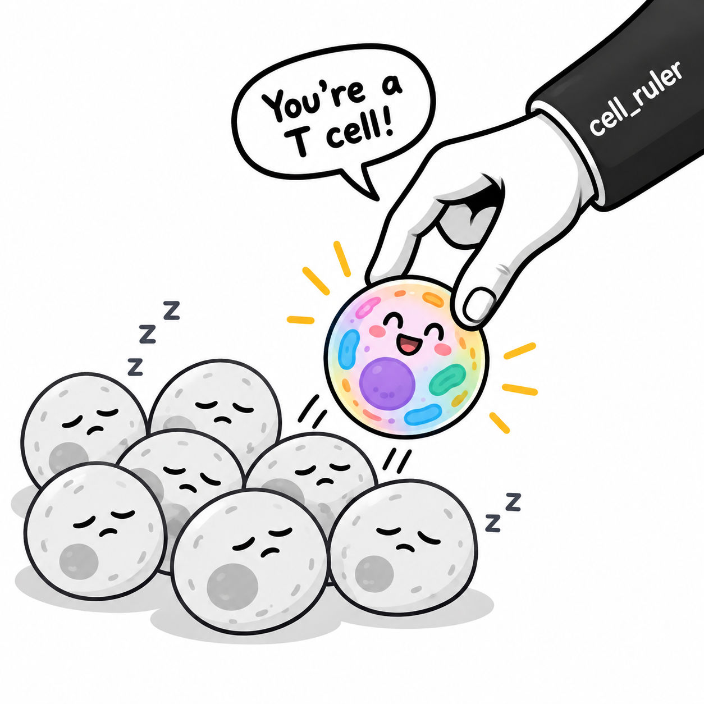

# KIDS26-Team18 — Cell Identity in Spatial OMICs

Exploring how **cluster-based** and **cell-based (rule-based)** annotation approaches compare across imaging-based spatial transcriptomics platforms (Xenium, CosMx).

**Start here → [`data/README.md`](data/README.md)**

That file has everything you need: dataset catalog, BOX download link (when ready), collaboration standards, and links to [`src/`](src/README.md), [`env/`](env/README.md), and [`result/`](result/).

**Team lead:** Maycon Marção ([@Mmaycon](https://github.com/Mmaycon))

**CellRuler:** CellRuler: A Rule-Based Method for Cell-Type Annotation in Image-Based Spatial OMICs
