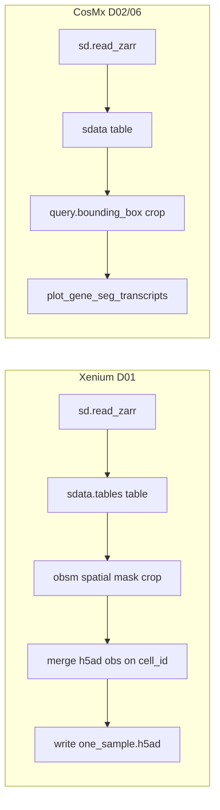

# KIDS26-Team18 — Data & Collaboration Guide

**Cell Identity in Spatial OMICs Imaging Platforms: Cluster-Based vs Cell-Based Annotation**

This document is the main entry point for the repository: how datasets are organized, where to download shared outputs, and how the team collaborates. Shared Python utilities live in [`../src/README.md`](../src/README.md); analysis outputs in [`../result/`](../result/).

**Team lead:** Maycon Marção ([@Mmaycon](https://github.com/Mmaycon)) — see [`../project-management/team.md`](../project-management/team.md).

---

## About

Cell type annotation in imaging-based transcriptomics sits at the core of how we interpret biology, yet we still rely on two fundamentally different strategies without fully understanding how they relate to each other. **Cluster-based** annotation assigns identity at the population level; **cell-based** (rule-based) annotation applies explicit gene rules to classify individual cells. Imaging platforms detect transcripts as spatial spots, making rule-based annotation intuitive — but thresholds, marker specificity, and agreement with clustering remain open questions.

This repo tests both approaches across public Xenium and CosMx datasets, with shared QC notebooks and utilities so the team can compare methods on equal footing.

---

## Repository layout

```text
KIDS26-Team18/
├── data/          # datasets, raw builds, QC notebooks (you are here)
├── src/           # shared Python utilities
├── result/        # analysis outputs and templates
├── env/           # conda environment
└── project-management/
```

Inside every `data/Dataset_XX/` folder:

```text
Dataset_XX/
├── raw_data/                 # Original downloads + build scripts + sdata.zarr
├── metadata/                 # Sample tables and variable definitions
├── processed_data/           # Shared, standardized outputs (when applicable)
└── analysis/                 # Per-analyst workspaces
    └── <your_name>/
        ├── notebooks/
        ├── scripts/
        └── results/
```

| Folder | Purpose |
|--------|---------|
| `raw_data/` | Immutable source files. Document the source in `raw_data/README.md`. |
| `metadata/` | `sample_metadata.csv`, `variable_dictionary.xlsx`, cohort notes. |
| `processed_data/` | Team-facing `adata.h5ad`, `sdata.zarr` for downstream analyses. |
| `analysis/<your_name>/` | Personal notebooks, scripts, and intermediate results. |

---

## Links

### Download processed SpatialData (BOX)

> **Status:** https://stjude.box.com/s/aoovq13r3s0myv4qoo63xm785e459uls

| Archive | BOX link | Contents | Extract to |
|---------|----------|----------|------------|
| `zarr.tar.gz` | *TBD* | Pre-built `sdata.zarr` stores | `data/Dataset_XX/raw_data/` |

### External data sources

| Dataset | Accession / source |
|---------|-------------------|
| 01 — Lung Xenium TMA | [GSE250346](https://www.ncbi.nlm.nih.gov/geo/query/acc.cgi?acc=GSE250346) |
| 02 — Lung CosMx | [GSE299786](https://www.ncbi.nlm.nih.gov/geo/query/acc.cgi?acc=GSE299786) |
| 03 — Kidney Xenium | [10x Xenium Protein FFPE Human Renal Carcinoma](https://www.10xgenomics.com/datasets/xenium-protein-ffpe-human-renal-carcinoma) |
| 04 — TBD | — |
| 05 — Skin Xenium | [GSE301280](https://www.ncbi.nlm.nih.gov/geo/query/acc.cgi?acc=GSE301280) |
| 06 — Skin CosMx | [GSE314158](https://www.ncbi.nlm.nih.gov/geo/query/acc.cgi?acc=GSE314158) |

### In-repo documentation

| Doc | Description |
|-----|-------------|
| [`../src/README.md`](../src/README.md) | Shared helpers: `spatial_plot`, `load_explore`, scanpy plotting |
| [Analysis workflows & key functions](#analysis-workflows--key-functions) | Function reference for QC and cell-typing notebooks (Xenium + CosMx) |
| [`../env/README.md`](../env/README.md) | Conda environment (`spatialdata`, Python 3.12) |
| [`../result/`](../result/) | Analysis outputs and notebook templates |
| [`Dataset_03/raw_data/DEBUGGING.md`](Dataset_03/raw_data/DEBUGGING.md) | Known Xenium transcript overlay issues and fixes |
| [`Dataset_01/README.md`](Dataset_01/README.md) | Dataset 01 (lung TMA) specifics |

---

## Analysis workflows & key functions

Function-level reference for the team QC and cell-typing notebooks. Dataset 01 `processed_data` notebooks are **Xenium-only**; CosMx equivalents come from Dataset 02/06 `raw_data/00_load_and_explore.ipynb` and shared helpers in [`../src/`](../src/). Full API tables: [`../src/README.md`](../src/README.md).

**Kernel:** `spatialdata` conda env for all notebooks below.

### Notebook map

| Notebook | Platform | Input | Output | `src/` imports |
|----------|----------|-------|--------|----------------|
| [`Dataset_01/processed_data/00_load_and_explore.ipynb`](Dataset_01/processed_data/00_load_and_explore.ipynb) | Xenium | `TMA5.zarr`, `GSE250346_slim.h5ad` | `one_sample.h5ad` | none |
| [`Dataset_02–06/raw_data/00_load_and_explore.ipynb`](Dataset_02/raw_data/00_load_and_explore.ipynb) | CosMx | `sdata.zarr` | ROI QC plots | `load_explore`, `spatial_plot` |
| [`Dataset_01/processed_data/01_celltypeing_compare.ipynb`](Dataset_01/processed_data/01_celltypeing_compare.ipynb) | Xenium | `one_sample.h5ad` | annotated `adata` + comparison plots | `plot` |

### Platform differences (Xenium vs CosMx)

| Aspect | Xenium (Dataset 01) | CosMx (Dataset 02/06) |
|--------|---------------------|------------------------|
| Zarr path | `raw_data/TMA5.zarr` | `raw_data/sdata.zarr` |
| Spatial coords for crop/QC | `obsm["spatial"]` | `obsm["global"]` |
| Segmentation shape key | `cell_circles` (also `cell_boundaries`) | `cell_boundaries` |
| Transcript gene column | `feature_name` | `target` |
| Cell ID column (points) | `cell_id` | `cell_uid` |
| Crop method | boolean mask on AnnData coords | `sdata.query.bounding_box(...)` |
| Morphology | `images["morphology_focus"]` pyramid | often none; optional `attach_morphology_mip` |

### Workflow A — Load & explore (`00_load_and_explore`)

#### Shared (both platforms)

| Function / pattern | Purpose |
|--------------------|---------|
| `sd.read_zarr(path)` | Load SpatialData zarr store |
| `sdata.tables["table"]` / `sdata["table"]` | Cell-level AnnData table |
| `sdata.images`, `.labels`, `.shapes`, `.points`, `.tables` | Inspect store elements |
| Count QC on `.X` | Assert non-negative integers; row sums match `nCount` / `transcript_counts` |

```python
import spatialdata as sd
import spatialdata_plot  # registers .pl accessor

sdata = sd.read_zarr(ZARR_PATH)
table = sdata.tables["table"]
```

#### Xenium (Dataset 01)

| Step | Function / pattern | Notes |
|------|-------------------|-------|
| Spatial overview | `table.obsm["spatial"]` + `plt.scatter` | Subsample ≤50k cells; `set_aspect("equal")` |
| ROI crop | boolean mask on coords → `table[mask].copy()` | e.g. `x∈[200,4000]`, `y∈[16300,20000]` |
| Metadata join | `sc.read_h5ad(H5AD_PATH, backed="r")` + `obs.merge(..., on="cell_id")` | Adds `final_CT`, `sample_id`, `coord_x/y`, etc. |
| Column rename | `obs.rename({"transcript_counts": "nCount", "total_counts": "nFeature"})` | Align with Scanpy conventions |
| Export | `adata.write_h5ad("one_sample.h5ad")` | Optional; feeds cell-typing notebook |

```python
import scanpy as sc

adata_ref = sc.read_h5ad(H5AD_PATH, backed="r")
h5ad_obs = adata_ref.obs.drop_duplicates(subset="cell_id", keep="first").copy()
adata.obs = adata.obs.merge(h5ad_obs, on="cell_id", how="left")
```

#### CosMx (Dataset 02/06)

| Step | Function / pattern | Notes |
|------|-------------------|-------|
| Path setup | `setup_notebook_paths(raw_dir=RAW_DIR)` | Adds `src/` to `sys.path` |
| ROI crop | `sdata.query.bounding_box(...)` | Crop on global coordinates |
| Segmentation plot | `sdata.pl.render_shapes("cell_boundaries", ...)` | Cell polygon overlay |
| Transcript plot | `.pl.render_points("transcripts", color="target", groups=GENE)` | Gene-specific spots |
| Combined overlay | `plot_gene_seg_transcripts(sdata_crop, GENE, ...)` | Auto-infers shape key and feature column |
| Advanced crop | `build_plot_crop`, `transcript_roi_center` | For large stores when bbox under-filters transcripts |

```python
from load_explore import setup_notebook_paths
from spatial_plot import plot_gene_seg_transcripts

setup_notebook_paths(raw_dir=RAW_DIR)
sdata_crop = sdata.query.bounding_box(...)
plot_gene_seg_transcripts(sdata_crop, "EPCAM", point_size=0.5, point_alpha=0.6)
```



### Workflow B — Cell typing & comparison (`01_celltypeing_compare`)

Runs on `one_sample.h5ad` produced by Workflow A. Compares cluster-based (Scanpy) vs rule-based (cell-level) annotation.

#### Load

```python
import anndata as ad
from plot import SpatialCoord_plot, custom_barplot

adata = ad.read_h5ad(".../processed_data/one_sample.h5ad")
```

#### Approach i — Scanpy cluster-based

Uses all 343 genes (no HVG subset) — appropriate for targeted panels.

| Step | Function | Key parameters |
|------|----------|----------------|
| Normalize | `sc.pp.normalize_total` | `target_sum=1e4` |
| Log | `sc.pp.log1p` | — |
| Scale | `sc.pp.scale` | `max_value=10` |
| PCA | `sc.tl.pca` | `n_comps=30`, `random_state=42` |
| Neighbors | `sc.pp.neighbors` | `n_neighbors=15` |
| Cluster | `sc.tl.leiden` | `resolution=0.5`, `key_added="leiden"` |
| Embed | `sc.tl.umap` | `random_state=42` |
| Markers | `sc.tl.rank_genes_groups` | `groupby="leiden"`, `method="wilcoxon"` |
| Marker table | `sc.get.rank_genes_groups_df` | per-cluster top genes |
| Plot markers | `sc.pl.rank_genes_groups_dotplot` | — |
| Manual map | `CLUSTER_ANNOTATIONS` dict | Leiden ID → `cell_type_scanpy` |
| Plot | `sc.pl.umap`, `SpatialCoord_plot` | spatial uses `coord_x` / `coord_y` |

#### Approach ii — Rule-based (inline helpers)

| Helper | Purpose |
|--------|---------|
| `detection_rate(adata, genes)` | Fraction of cells with count > 0 per gene; pick top 4 EPI / B-cell markers |
| `_get_gene_counts(adata, genes)` | Raw count matrix for gene panel from `.X` |
| `assign_rule_labels(adata, genes_epi, genes_bcell)` | All-4-genes-positive rule → `cell_type_rule` |

Rule logic: epithelial if all 4 EPI markers > 0 and no B-cell markers; B cell if reverse; `Ambiguous` if both; else `Unassigned`.

Validation: `sc.pl.umap`, `sc.pl.dotplot`, `SpatialCoord_plot`.

Packaged equivalents: [`../src/biohack_template/celltyping_scanpy.py`](../src/biohack_template/celltyping_scanpy.py), [`../src/biohack_template/celltyping_rule_based.py`](../src/biohack_template/celltyping_rule_based.py).

#### Comparison

| Function / pattern | Purpose |
|--------------------|---------|
| `pd.crosstab(..., margins=True)` | Confusion matrix between methods |
| `pd.crosstab(..., normalize="index")` | Row-normalized proportions |
| `custom_barplot(adata, var_1="cell_type_rule", var_2="cell_type_scanpy", cluster_bars=False)` | Stacked proportion barplot |
| `pd.crosstab(final_CT, cell_type_scanpy)` | Compare vs published reference labels |

### Custom `src/` functions

| Function | Module | Used in | Purpose |
|----------|--------|---------|---------|
| `setup_notebook_paths` | `load_explore` | CosMx `00_load_and_explore` | Bootstrap `src/` imports |
| `plot_gene_seg_transcripts` | `spatial_plot` | CosMx QC | Segmentation + transcript overlay |
| `build_plot_crop` | `spatial_plot` | large zarr crops | Correct transcript filtering after bbox |
| `SpatialCoord_plot` | `plot` | `01_celltypeing_compare` | Spatial scatter from `coord_x` / `coord_y` |
| `custom_barplot` | `plot` | `01_celltypeing_compare` | Stacked proportion comparison |

See [`../src/README.md`](../src/README.md) for `load_data`, `io`, and `biohack_template` exports.

### Quick-start imports

```python
# SpatialData QC (CosMx D02/06 style)
from load_explore import setup_notebook_paths
from spatial_plot import plot_gene_seg_transcripts

setup_notebook_paths(raw_dir=RAW_DIR)
```

```python
# AnnData / cell typing (Dataset 01 processed_data)
from plot import SpatialCoord_plot, custom_barplot
```

---

## Dataset catalog

| Dataset | Platform | Tissue | Folder | QC notebook | Build |
|---------|----------|--------|--------|-------------|-------|
| 01 | Xenium TMA | Lung | [`Dataset_01/`](Dataset_01/) | [`processed_data/00_load_and_explore.ipynb`](Dataset_01/processed_data/00_load_and_explore.ipynb) | — |
| 02 | CosMx | Lung | [`Dataset_02/`](Dataset_02/) | [`raw_data/00_load_and_explore.ipynb`](Dataset_02/raw_data/00_load_and_explore.ipynb) | [`build_sdata.py`](Dataset_02/raw_data/build_sdata.py) |
| 03 | Xenium | Kidney | [`Dataset_03/`](Dataset_03/) | [`raw_data/00_load_and_explore.ipynb`](Dataset_03/raw_data/00_load_and_explore.ipynb) | [`build_sdata.py`](Dataset_03/raw_data/build_sdata.py) |
| 04 | CosMx WTX | Kidney | [`Dataset_04/`](Dataset_04/) | [`raw_data/00_load_and_explore.ipynb`](Dataset_04/raw_data/00_load_and_explore.ipynb) | [`build_sdata.py`](Dataset_04/raw_data/build_sdata.py) |
| 05 | Xenium | Skin | [`Dataset_05/`](Dataset_05/) | [`raw_data/00_load_and_explore.ipynb`](Dataset_05/raw_data/00_load_and_explore.ipynb) | [`build_sdata.py`](Dataset_05/raw_data/build_sdata.py) |
| 06 | CosMx | Skin | [`Dataset_06/`](Dataset_06/) | [`raw_data/00_load_and_explore.ipynb`](Dataset_06/raw_data/00_load_and_explore.ipynb) | [`build_sdata.py`](Dataset_06/raw_data/build_sdata.py) |

Source paths, cell counts, and build instructions: see each dataset's [`raw_data/README.md`](Dataset_02/raw_data/README.md).

**Kernel:** `spatialdata` conda env (Python ≥3.11, spatialdata ≥0.7.2). See [`../env/README.md`](../env/README.md).

---

## How to collaborate

### 1. Pick a dataset and claim your analyst folder

- Work inside one `Dataset_XX/` at a time unless coordinating across datasets.
- Add a folder under `analysis/`:

  ```bash
  mkdir -p data/Dataset_02/analysis/Your_Name/{env,notebooks,results,scripts}
  touch data/Dataset_02/analysis/Your_Name/README.md
  ```

- Keep personal exploration in **your** `analysis/<your_name>/` directory.
- Only write to `processed_data/` when outputs are reviewed and ready for the team.

### 2. Document raw data sources

In `raw_data/README.md`, record:

- Where the data came from (GEO accession, vendor portal, internal path)
- Download date and version
- Any preprocessing applied before placing files here

### 3. Share metadata early

- Fill in `metadata/sample_metadata.csv` with one row per sample (or per slide/FOV).
- Maintain `metadata/variable_dictionary.xlsx` so every column is defined.
- Update `metadata/README.md` with cohort-specific notes.

### 4. Coordinate on processed outputs

`processed_data/` is the **single source of truth**. Before overwriting `adata.h5ad` or `sdata.zarr`:

1. Announce the change to collaborators.
2. Confirm naming conventions below are met.
3. Leave a short note in `processed_data/README.md` (date, author, what changed).

### 5. Respect boundaries

| Do | Don't |
|----|-------|
| Work in `analysis/<your_name>/` | Edit another analyst's notebooks without permission |
| Read from `raw_data/` and `processed_data/` | Delete or rename files in `raw_data/` |
| Document assumptions in your README | Overwrite shared processed files silently |
| Use reproducible scripts in `scripts/` | Rely only on hard-coded notebook paths |

---

## Processed data standards

### AnnData (`.h5ad`)

| Component | Requirement |
|-----------|-------------|
| Raw counts | `adata.layers["counts"]` |
| Cell metadata | `adata.obs` — cell type column: `celltype_{your_name}` |
| Gene metadata | `adata.var` |
| Sample ID | `adata.obs`: `sample_id`, `TMA_core`, `donor_id`, `tissue_section_id` |
| Spatial coordinates | `adata.obs`: `coord_x`, `coord_y` |
| SpatialData link | `adata.obs`: `cell_id_to_sdata` (from `adata.obs_names`) |
| Embeddings | `adata.obs`: `UMAP1`, `UMAP2` (if computed) |

### SpatialData (`.zarr`)

| Element | Content |
|---------|---------|
| **Points** | Transcript-level coordinates (when available) |
| **Shapes** | Cell segmentation polygons or circles |
| **Images** | Histology or microscopy images |
| **Tables** | Standardized AnnData (`sdata.tables["table"]`) |

### Keeping AnnData and SpatialData in sync

1. Set `adata.obs["cell_id_to_sdata"]` from your cell identifiers.
2. Before updating `sdata.tables["table"]`:

   ```python
   adata.obs_names = adata.obs["cell_id_to_sdata"].values
   ```

3. `adata.obs_names` must match the AnnData stored in `sdata.tables["table"]`.

---

## Create a new dataset folder

```bash
DATASET_NUM=07
DATASET="data/Dataset_${DATASET_NUM}"

mkdir -p "$DATASET"/analysis/Analyst_Name01/{env,notebooks,results,scripts} \
         "$DATASET"/metadata \
         "$DATASET"/processed_data \
         "$DATASET"/raw_data

touch "$DATASET"/metadata/README.md \
      "$DATASET"/metadata/sample_metadata.csv \
      "$DATASET"/processed_data/README.md \
      "$DATASET"/raw_data/README.md
```

Fill in `raw_data/README.md` with the data source and add a row to the [dataset catalog](#dataset-catalog) above.

---

## Quick checklist before sharing processed data

- [ ] Raw counts in `adata.layers["counts"]`
- [ ] Spatial coords in `adata.obs['coord_x']`, `adata.obs['coord_y']`
- [ ] Cell type column named `adata.obs['celltype_{your_name}']`
- [ ] `adata.obs['cell_id_to_sdata']` populated from `adata.obs_names`
- [ ] UMAP in `UMAP1`, `UMAP2` (if computed)
- [ ] SpatialData `.zarr` present when polygons/transcripts/images exist
- [ ] `metadata/sample_metadata.csv` and dictionary updated
- [ ] `processed_data/README.md` describes the current version

---

## Questions?

If conventions conflict with your platform (Xenium, CosMx, Visium, etc.), document the deviation in the dataset's `raw_data/README.md` and discuss with the team before merging into `processed_data/`.
